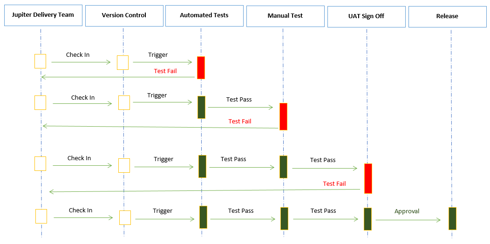
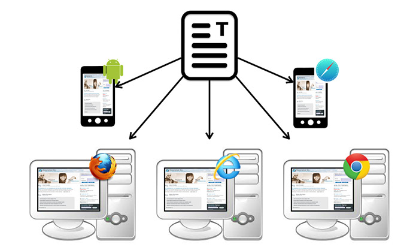

# Automation Best Practices

## Continuous delivery from a quality perspective 

## Decide What Test Cases to Automate

It is impossible to automate all testing, so it is important to
determine what test cases should be automated first.

The benefit of automated testing is linked to how many times a given
test can be repeated. Tests that are only performed a few times are
better left for manual testing. Good test cases for automation are ones
that are run frequently and require large amounts of data to perform the
same action.

You can get the most benefit out of your automated testing efforts by
automating:

-   Repetitive tests that run for multiple builds.
-   Tests that tend to cause human error.
-   Tests that require multiple data sets.
-   Frequently used functionality that introduces high risk conditions.
-   Tests that are impossible to perform manually.
-   Tests that run on several different hardware or software platforms
    and configurations.
-   Tests that take a lot of effort and time when manual testing.
-   Tests to provide acceptable coverage over the various Test levels.
    See: [Test Levels]([https://confluence.qantas.com.au/display/QQE/Test+Levels)

## Test Early and Test Often

To get the most out of your automated testing, testing should be started
as early as possible and ran as often as needed. The earlier testers get
involved in the life cycle of the project the better, and the more you
test, the more bugs you find. Automated unit testing can be implemented
on day one and then you can gradually build your automated test suite.
Bugs detected early are a lot cheaper to fix than those discovered later
in production or deployment.

With the shift left movement, developers and advanced testers are now
empowered to build and run tests. Tools such as TestLeft allows users to
run functional UI tests for web and desktop applications from within
their favorite IDEs. With support for Visual Studio and Java IDEs such
as IntelliJ and Eclipse, developers never have to leave the comfort of
their ecosystem to validate application quality - meaning teams can
quickly and easily shift left to deliver software faster.

1.  See [Squads](https://confluence.qantas.com.au/display/QQE/Squads) to understand QE ceremony roles and ways to influence other disciplines within your squad. 

  

## Select the Right Automated Testing Tool

Selecting an automated testing tool is essential for test automation.
There are a lot of automated testing tools on the market, and it is
important to choose the automated testing tool that best suits your
overall requirements.

Consider these key points when selecting an automated testing tool:

-   Support for your platforms and technology. Are you testing .Net, C\# or WPF applications and on what operating systems? Are you going to test web applications? Do you need support for mobile application testing? Do you work with Android or iOS, or dp you work with both operating systems?

-   Flexibility for testers of all skill levels. Can your QA department write automated test scripts or is there a need for keyword testing?

-   Feature rich but also easy to create automated tests. Does the automated testing tool supports record-and-playback test creation as well as manual creation of automated tests; does it include features for implementing checkpoints to verify values, databases, or key functionality of you application?

-   Create automated tests that are reusable, maintainable and resistant to changes in the applications UI. Will my automated tests break if my UI changes?

For detailed information about selecting automated testing tools for automated testing, see Selecting Automated Testing Tools.

  

## Version Control

We use [Git](https://git-scm.com/) open source code control to manage our code and bitbucket for hosting our Git repositories.  
  

## Continuous Integration / Continuous Delivery

Continuous integration/Continuous delivery (**CI**/**CD**) Continuous integration (**CI**) is a software engineering practice where members of
a team integrate their work with increasing frequency. Continuous delivery (**CD**) is to packaging and deployment what **CI** is to build
and test.

We at Qantas believe in Continuous Integration and Continuous Delivery. We release our features almost every week. 

#### Process

Developers implement the feature in a feature branch and then it is given to a tester to test. As the code is pushed in the repo the bamboo CI build gets triggered where we run all the unit tests and make sure all the tests have passed and the build is ready for testers to be tested. A tester then deploys the feature branch on the test environment
and manually tests all the scenarios and identify all the possible scenarios that can be automated and automate them. Once the feature looks good it is then merged into develop branch and it is ready for
Release. We deploy the Release package on staging environment and trigger our Regression suit for every Release on staging environment. If
everything looks good on our staging environment then we go for Blue green deployment on Production and trigger our Regression on blue and then green. A process snapshot from one of the existing teams looks like below.

## Cross browser testing

-   Cross browser testing is a process that ensures your website or application behaves as expected across multiple browsers.
-   Cross browser testing can be time consuming. Automated methods like unit testing, functional testing or visual regression do not capture cross browser bugs. So as of yet, it can only be done manually. Because every test starts from usage statistics, simplifying the statistics only makes sense. This means, taking into account only the meaningful platform/operating system/vendor/version combinations. For the most part, differences between versions, platforms and operating systems can be omitted.
-   Browser neutral bugs can waste time. These are stylistic bugs, incapable of being caught by automated methods, but that have nothing to do with a specific browser. Falsely assuming that a browser-neutral bug is browser specific can waste time.
-   A short list of techniques that can be used to catch them are:

    -   resizing the browser
    -   zooming in and out if applicable
    -   turning JavaScript off
    -   turning CSS off
    -   turning off both CSS and JavaScript
    -   using only a keyboard to interact with the
application.

Any browser can be used.

We at Qantas use browserstack for cross browser testing.

### Mobile testing

#### Good mobile testing practices

-   Ensure that you have access to all physical devices on which the application run (Not just emulators or simulators)
-   Consider the additional time and/or personnel needed to test all the application’s modules on all the devices.
-   Have an explicit list of devices on which QA will be performed. Basically this means that the company is committing to supporting certain devices and Operating Systems on which the application will perform as designed. The users will be informed that even though the application might work on other devices, the company will not be held responsible for unexpected issues. This is the approach taken by most leading vendors today, including for example, Skype.
-   Implement a mixed strategy when you have a scenario where you do not have all the possible devices and therefore cannot do exhaustive testing on each:  Use an emulator on the early stages of app development.  Keep adding real devices into the testing later down the development cycle. This way you can certify that all the requirements and goals are being covered.