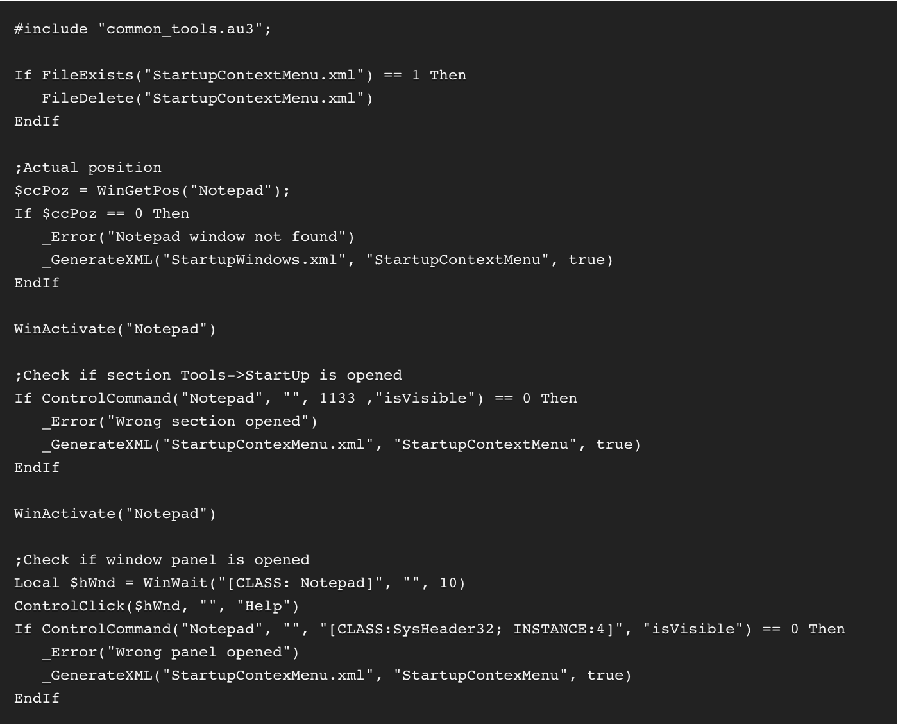

# Desktop Applications

Desktop application (or Standalone app) is designed to run on single
work stations or PC, so when you are about to test the desktop
application you need to put your attention to a specific environment
prepared for testing. It is easy to broadly automate a standalone
application because of the fact that test tool has direct access to
tested application. Desktop Applications are different to Web
applications in the following ways:

-   Application runs in single memory (Front end and Back end in one
    place),
-   Single user only (operating system user account),
-   May or may not be resource sharing (files and databases),
-   State of an application can be almost always determined,
-   Access to the local file system

At Qantas we do not advocate any one commercial tool as there is no such
thing as  "best tool". Variety of tools are available both paid and
free, and the purpose of each tool is different and Quality engineer
should be aware of that. There are tools that work better with
applications containing custom controls, other tools are more efficient
with small applications and there are even tools that are quite good for
beginners in automation.

Outlined below are some open source tools which are currently being used
at Qantas for some applications. While the tools can differ for
application to application based on the needs, the principles for
automation should align as much as possible as per other sections of
this playbook.

  

### Sikuli

**Sikuli** is a visual technology to automate graphical user interfaces
(GUI) using images (screenshots). **Sikuli** Script automates anything
you see on the screen without internal API's support. Sikuli is designed
to automate almost any kind of computer operations using simplified
computer vision engine. The engine recognizes areas of Graphical User
Interface based on patterns from screenshots that were prepared during
test creation. Sikuli uses Jython/Java/Python script languages to take
actions.

  

  

  

The following [link](index) provides excellent reference on getting
started with Sikuli

  

### AutoIT

AutoIT is a very small, self-contained automation tool that is designed
mostly for automating application for Windows platform. However, nothing
stands in the way to prepare scripts for routine actions, like file
operations, application handling, resources monitoring, and so on. It is
based on communication with Windows (or tested application) by
generating common Windows events: sending keys combination, mouse
movement and click events, or even windows form/control manipulation. At
this time, the tool is considered as the fastest available automation
tool. It is perfect for carrying out all kinds of tests that are related
to performance: performance testing, stability testing, etc.

  

{height="400"}

### TestComplete

**TestComplete** is a functional testing tool developed by [SmartBear
Software](https://en.wikipedia.org/wiki/SmartBear_Software "SmartBear Software").
It can be used for testing many different application types
including Web, Windows, Android, iOS, WPF, HTML5, Flash, Flex, Silverlight, .NET, VCL and Java.

We recommend NOT to use the Record and Replay approach of this tool but
instead the Keyword driven framework to better maintainability and ROI
for Test Automation.

### RPA using BluePrism

[Robotic process
automation](https://en.wikipedia.org/wiki/Robotic_process_automation "Robotic process automation") (RPA
or RPAAI) is the application of technology that provides organizations
with a digital workforce that follows rule-based business processes and
interacts with the organisations systems in the same way that existing
users currently do. Blue Prism coined the term "robotic automation" in
2012. 

Currently Amadeus teams within Qantas are using Blueprism for automated
test data generation on Amadeus UI.

  

## Attachments:

{width="8" height="8"}
[example-test-case.png](attachments/119670019/119674043.png)
(image/png)  
{width="8" height="8"}
[AutoIT.png](attachments/119670019/119684251.png) (image/png)  
{width="8" height="8"}
[TestComplete.png](attachments/119670019/119684272.png) (image/png)  
