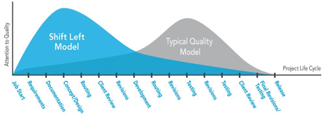

# Test Early and Test Often

To get the most out of your automated testing, testing should be started
as early as possible and ran as often as needed. The earlier testers get
involved in the life cycle of the project the better, and the more you
test, the more bugs you find. Automated unit testing can be implemented
on day one and then you can gradually build your automated test suite.
Bugs detected early are a lot cheaper to fix than those discovered later
in production or deployment.

With the shift left movement, developers and advanced testers are now
empowered to build and run tests. Tools such as TestLeft allows users to
run functional UI tests for web and desktop applications from within
their favorite IDEs. With support for Visual Studio and Java IDEs such
as IntelliJ and Eclipse, developers never have to leave the comfort of
their ecosystem to validate application quality - meaning teams can
quickly and easily shift left to deliver software faster.

1.  See [Squads]](https://confluence.qantas.com.au/display/QQE/Squads) to understand QE ceremony roles and ways to influence other disciplines within your squad.

